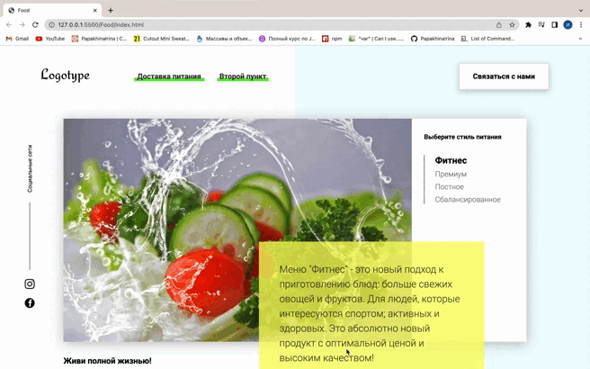
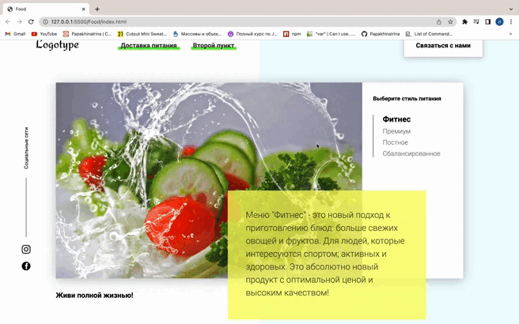
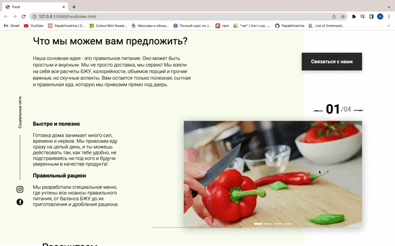
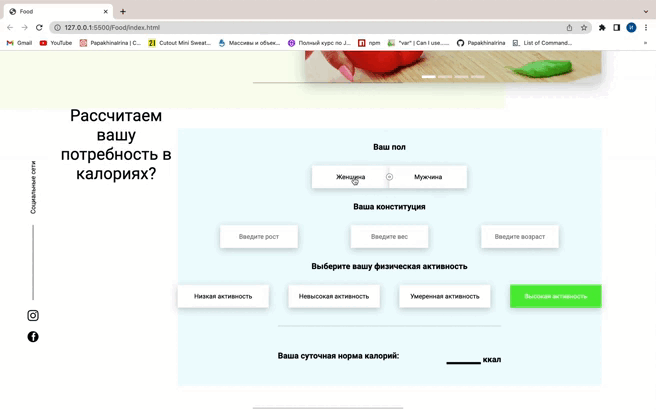

>> # FoodProject :leafy_green:
## Сайт по подбору здорового питания исходя из личных педпочтений и физических качеств заказчика. 
___

# Стэк - Express js, HTML, CSS.

## Разработчик : [Ирина Папахина](https://github.com/PapakhinaIrina)
___

Сайт создан в рамках работы над заданиями курса Ивана Петриченко ["Полный курс по JavaScript + React - с нуля до результата"](https://www.udemy.com/course/javascript_full/)

___
- На сайте пользователь сможет подобрать план питания исходя из физических данных таких как, пол, рост, вес, физическая активность. Также пользователь может оставить свои контактные данные для обратной связи с администрацией сайта.

___
# Задачи сайта
:white_check_mark: **Получение контактной информации пользователя**

Каждый пользователь может ввести свои данные в форму обратной связи. Данные будут переданы на сервер. Форма открывается как при нажатии на кнопку "Связаться", так и если пользователь находится на странице более 5 секунд всплывающее окно появляется автоматически. Предусмотрено также, что пользователь полностью ознакомившись со страницей и пролистав её до самого конца, может заполнить форму в всплывающем окне.

_____

:white_check_mark: **Ознакомлениe пользователя с меню**

____
:white_check_mark: **Слайдеры**

Слайдер, который можно использовать как галерею изображений, отзывы покупателей или поэтапные рекомендации для достижения лучших результатов.

___

:white_check_mark: **Калькулятор суточной нормы для пользователя**

В этом блоке каждый пользователь может рассчитать суточную норму калорий. Здесь учитыввается пол, вес, рост, возраст, а также физическая активность в течении дня. Если пользователь указывает неверные данные, то окно посвечивается красныц цветом.

___

